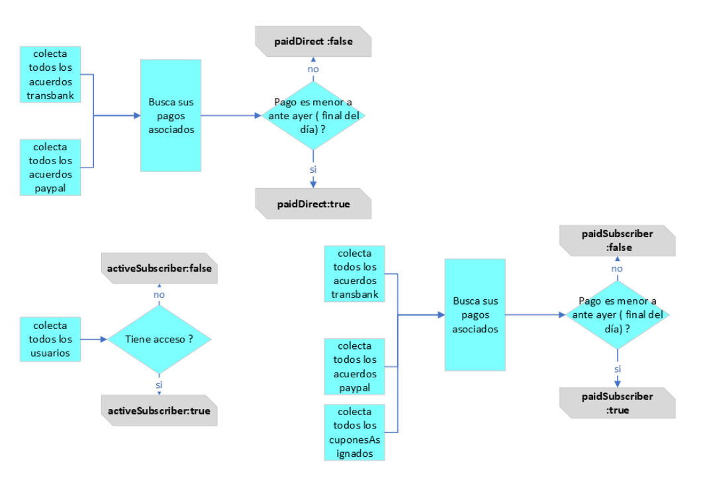
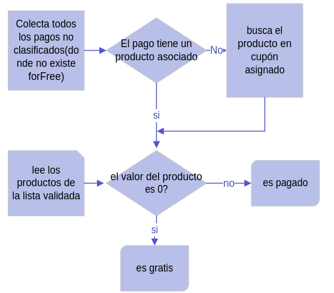

# USER CONTEXT

## DEFINITION

This piece of software merge tree ones that handle  the flags to migration: paidSubscriber, paidDirect and activeSubscriber.

### flow

### Data

| Field             |           | type   | default |    comment                                                                       |
| ------------------|---------- |------- |---------|----------------------------------------------------------------------------------|
| paidSubscriber    |           | bolean |         | if true user own a current and valid paypal, transbank or cupon payment          |
| paidDirect        |           | bolean |  null   | if true user own a current and valid paypal or transbank susbcription payment    |
| activeSubscriber  |           | bolean |         | if true user have  access to paid content, null if not exists                    |

### Deployment
You need Admin/DevOps Credentials to cdf-orion account
Setup AWS Credentials

# PAYMENT CONTEXT
This module adds some value to the payment (transaction) to establish whether it is free or paid. If the product payment does not appear in the payment collection then it is assumed to be a coupon assignment.

### flow

This piece of software merge tree ones that handle  the flags to migration: paidSubscriber, paidDirect and activeSubscriber.

## Data

| Field             |           | type   | default |    comment                                                                       |
| ------------------|---------- |------- |---------|----------------------------------------------------------------------------------|
| paidSubscriber    |           | bolean |         | if true user own a current and valid paypal, transbank or cupon payment          |
| paidDirect        |           | bolean |  null   | if true user own a current and valid paypal or transbank susbcription payment    |
| activeSubscriber  |           | bolean |         | if true user have  access to paid content, null if not exists                    |

## Deployment
You need Admin/DevOps Credentials to cdf-orion account
Setup AWS Credentials

### Data

| Field             | type   | default |    comment                                                                       |
| ------------------|--------|---------|----------------------------------------------------------------------------------|
| forFree           | bolean |   null  | if true payment mean a money transaction                                         |
